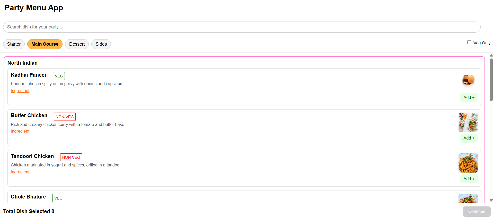
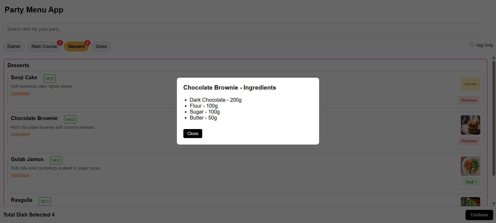

# 🍽️ Party Menu App

A ReactJS web application that allows users to browse dishes, filter them by category, search, and select items for a party.  
Users can also view detailed ingredients in a modal.

---

## 🚀 Features

- 🔎 **Search dishes** by name or description  
- 🍛 **Category filters**: Starter, Main Course, Sides, Dessert, etc.  
- 🥦 **Veg-only filter** toggle  
- ➕➖ **Add/Remove dishes** to your party menu  
- 📊 **Category-based dish count badges**  
- 📋 **Summary bar** showing selected items  
- 🧾 **Ingredients modal** for each dish  
- 📱 **Fully responsive** across mobile, tablet, and desktop  

---

## 📂 Project Structure

```
party-menu-app/
├── src/
│ ├── components/
│ │ ├── DishCard/
│ │ │ └── index.js
│ │ ├── DishList/
│ │ │ └── index.js
│ │ ├── Filters/
│ │ │ └── index.js
│ │ ├── IngredientModal/
│ │ │ └── index.js
│ ├── data/
│ │ └── mockDishes.js
│ ├── App.css
│ └── App.js
├── package.json
└── README.md
```

---

## 🛠️ Tech Stack

- **ReactJS** (Create React App)  
- **JavaScript (ES6+)**  
- **CSS** 

---

## ▶️ Getting Started

Follow these steps to run the app locally:

### 1. Clone the repository
```bash
git clone https://github.com/RohitRaparthi/party-menu-app.git
cd party-menu-app
```
### 2. Install dependencies
```bash
npm install
```

### 3. Start the development server
```bash
npm start
```

The app will be available at http://localhost:3000

## 📸 Screenshots

### 🏠 Home Screen


### 🍛 Ingredient Modal


## 📌 Future Improvements

- Add backend API instead of mock data

- User authentication (login/logout)

- Save selected menu items to database

- Dark mode support
